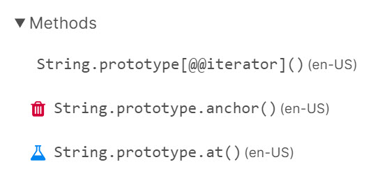

## Java Script의 데이터타입  
- String: "", '', ``
- Number  
- Boolean: true, false  
- undefined  
- null  
- Array: []  
- Object: {}  

## String
- [String MDN](https://developer.mozilla.org/ko/docs/Web/JavaScript/Reference/Global_Objects/String)
- `String` 전역 객체는 문자열의 생성자
  - 하지만 String 객체는 항상 new String()으로 생성하지는 않고 리터럴 형태로 생성하는 것을 허용하고 이를 더 자주 이용한다.
- MDN 문서를 보는것이 좋지만, 공식 문서처럼 작성되어 익숙해지는데 시간이 걸림
- 아이콘 예제  

  - 휴지통 모양은 잘 사용하지 않는 기능
  - 비커 모양은 실험적인 기능
- method
  - String.prototype.indexOf()
    ```javascript
    const str = 'Hello world!'
    console.log(str.indexOf('world'))
    console.log(str.indexOf('iamtk') !== -1)
    ```
  - String.prototype.replace()
    ```javascript
    const str = 'Hello world!'
    console.log(str.replace('world','iamtk'))
    ```  
  - String.prototype.slice()
    ```javascript
    const str = 'Hello world!'
    console.log(str.slice(6,11)) // endIndex 추출 종료점 인덱스로 그 직전까지 추출
    ```  
  - String.prototype.match()
    ```javascript
    const str = 'iamtkk2@gmail.com'
    console.log(str.match(/.+(?=@)/)[0]) // 정규표현식으로 필터링하고 반환된 배열 데이터의 인덱스로 값을 지정  
    // ?= 은 전방탐색(lookhead) 기호
    ```
  - String.prototype.trim()
    ```javascript
    const str = '    Hello world!   '
    console.log(str.trim())
    ```