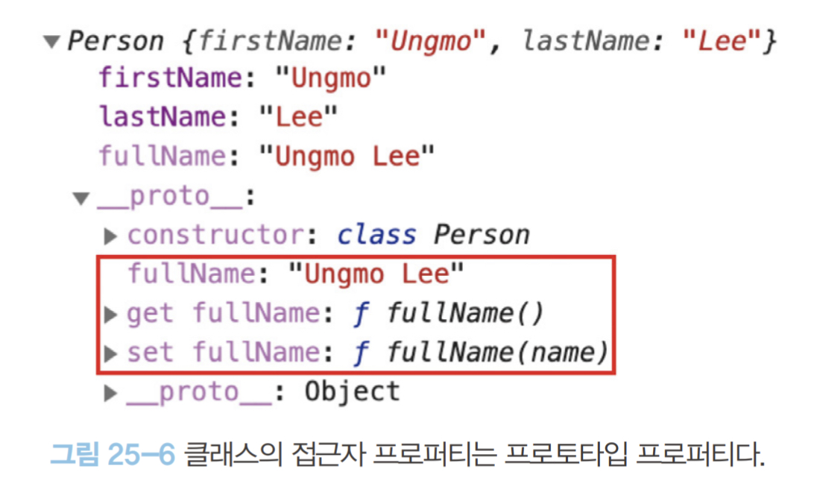

# 25.7 프로퍼티
## 25.7.1 인스턴스 프로퍼티
인스턴스 프로퍼티는 constructor 내부에서 정의해야 한다.

예제 25-33
```javascript
class Person {
  constructor(name) {
    // 인스턴스 프로퍼티
    this.name = name;
  }
}

const me = new Person('Lee');
console.log(me); // Person {name: "Lee"}
```
- contructor 내부 코드가 실행되기 이전에 constructor 내부의 this에는 이미 클래스가 암묵적으로 생성한 인스턴스의 빈 객체가 바인딩되어 있다.

예제 25-34
```javascript
class Person {
  constructor(name) {
    // 인스턴스 프로퍼티
    this.name = name; // name 프로퍼티는 public하다.
  }
}

const me = new Person('Lee');

// name은 public하다.
console.log(me.name); // Lee
```
- 인스턴스 프로퍼티는 언제나 `Public` 하다
  - ES6의 클래스는 다른 객체지향 언어처럼 private, public, protected 키워드와 같은 접근 제한자(access modifier)를 지원하지 않는다.
  - private한 프로퍼티를 정의할 수 있는 사양이 현재 제안 중에 있다.

## 25.7.2 접근자 프로퍼티
자체적으로는 값을 갖지 않고 다른 데이터의 값을 읽거나 저장할때 사용하는 접근자 함수(accessor functon)로 구성된 프로퍼티다.
즉 getter 함수와 setter 함수로 구성되어 있다.
- getter는 인스턴스 프로퍼티에 접근할 때마다 프로퍼티 값을 조작하거나 별도의 행위가 필요할때 사용한다.
  - `getter는 메서드 이름 앞에 get 키워드를 사용`해 정의한다.
- setter는 인스턴스 프로퍼티에 값을 할당할 때마다 프로퍼티 값을 조작하거나 별도의 행위가 필요할때 사용한다.
  - `setter는 메서드 이름 앞에 set 키워드는 사용`해 정의한다.

예제 25-35

객체 리터럴을 통한 접근자 프로퍼티 구성
```javascript
const person = {
  // 데이터 프로퍼티
  firstName: 'Ungmo',
  lastName: 'Lee',

  // fullName은 접근자 함수로 구성된 접근자 프로퍼티다.
  // getter 함수
  get fullName() {
    return `${this.firstName} ${this.lastName}`;
  },
  // setter 함수
  set fullName(name) {
    // 배열 디스트럭처링 할당: "36.1. 배열 디스트럭처링 할당" 참고
    [this.firstName, this.lastName] = name.split(' ');
  }
};

// 데이터 프로퍼티를 통한 프로퍼티 값의 참조.
console.log(`${person.firstName} ${person.lastName}`); // Ungmo Lee

// 접근자 프로퍼티를 통한 프로퍼티 값의 저장
// 접근자 프로퍼티 fullName에 값을 저장하면 setter 함수가 호출된다.
person.fullName = 'Heegun Lee';
console.log(person); // {firstName: "Heegun", lastName: "Lee"}

// 접근자 프로퍼티를 통한 프로퍼티 값의 참조
// 접근자 프로퍼티 fullName에 접근하면 getter 함수가 호출된다.
console.log(person.fullName); // Heegun Lee

// fullName은 접근자 프로퍼티다.
// 접근자 프로퍼티는 get, set, enumerable, configurable 프로퍼티 어트리뷰트를 갖는다.
console.log(Object.getOwnPropertyDescriptor(person, 'fullName'));
// {get: ƒ, set: ƒ, enumerable: true, configurable: true}
```
- MDN : [Object.getOwnPropertyDescriptor(obj, prop)](https://developer.mozilla.org/ko/docs/Web/JavaScript/Reference/Global_Objects/Object/getOwnPropertyDescriptor)
- Object.getOwnPropertyDescriptor() 메서드는 주어진 객체 자신의 속성(즉, 객체에 직접 제공하는 속성, 객체의 프로토타입 체인을 따라 존재하는 덕택에 제공하는 게 아닌)에 대한 속성 설명자(descriptor)를 반환합니다.
  - obj : 속성을 찾을 대상 객체
  - prop : 설명이 검색될 속성명

클래스를 통한 접근자 프로퍼티 구성

예제 25-36
```javascript
class Person {
  constructor(firstName, lastName) {
    this.firstName = firstName;
    this.lastName = lastName;
  }

  // fullName은 접근자 함수로 구성된 접근자 프로퍼티다.
  // getter 함수
  get fullName() {
    return `${this.firstName} ${this.lastName}`;
  }

  // setter 함수
  set fullName(name) {
    [this.firstName, this.lastName] = name.split(' ');
  }
}

const me = new Person('Ungmo', 'Lee');

// 데이터 프로퍼티를 통한 프로퍼티 값의 참조.
console.log(`${me.firstName} ${me.lastName}`); // Ungmo Lee

// 접근자 프로퍼티를 통한 프로퍼티 값의 저장
// 접근자 프로퍼티 fullName에 값을 저장하면 setter 함수가 호출된다.
me.fullName = 'Heegun Lee';
console.log(me); // {firstName: "Heegun", lastName: "Lee"}

// 접근자 프로퍼티를 통한 프로퍼티 값의 참조
// 접근자 프로퍼티 fullName에 접근하면 getter 함수가 호출된다.
console.log(me.fullName); // Heegun Lee

// fullName은 접근자 프로퍼티다.
// 접근자 프로퍼티는 get, set, enumerable, configurable 프로퍼티 어트리뷰트를 갖는다.
console.log(Object.getOwnPropertyDescriptor(Person.prototype, 'fullName'));
// {get: ƒ, set: ƒ, enumerable: false, configurable: true}
```
- `클래스의 메서드는 기본적으로 프로토타입 메서드`가 된다.
- 따라서 `클래스의 접근자 프로퍼티 또한 인스턴스 프로퍼티가 아닌 프로토타입의 프로퍼티`가 된다.
  - getOwnPropertyDescriptor에서 속성을 찾을 객체는 프로토타입으로 지정해야 한다. (Person.prototype)

예제 25-37
```javascript
// Object.getOwnPropertyNames는 비열거형(non-enumerable)을 포함한 모든 프로퍼티의 이름을 반환한다.(상속 제외)
console.log(Object.getOwnPropertyNames(me)); // -> ["firstName", "lastName"]
console.log(Object.getOwnPropertyNames(Object.getPrototypeOf(me))); // -> ["constructor", "fullName"]
```
- MDN : [Object.getOwnPropertyNames()](https://developer.mozilla.org/ko/docs/Web/JavaScript/Reference/Global_Objects/Object/getOwnPropertyNames)
  - Object.getOwnPropertyNames() 메서드는 전달된 객체의 모든 속성 (심볼을 사용하는 속성을 제외한 열거할 수 없는 속성 포함) 들을 배열로 반환합니다.
- MDN : [Object.getPrototypeOf](https://developer.mozilla.org/ko/docs/Web/JavaScript/Reference/Global_Objects/Object/getPrototypeOf)
  - Object.getPrototypeOf() 메서드는 지정된 객체의 프로토타입(가령 내부 [[Prototype]] 속성값)을 반환합니다.
