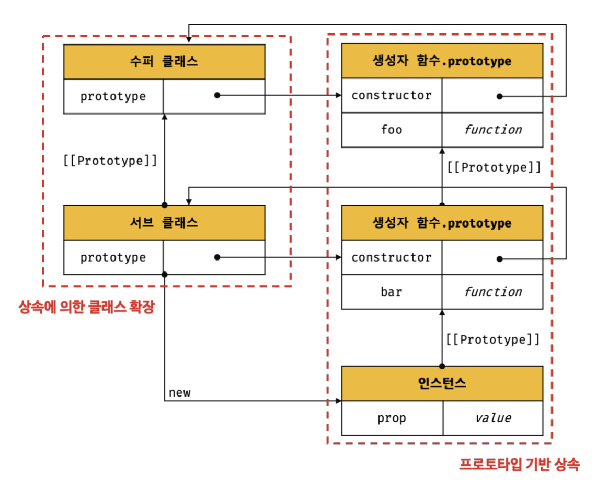
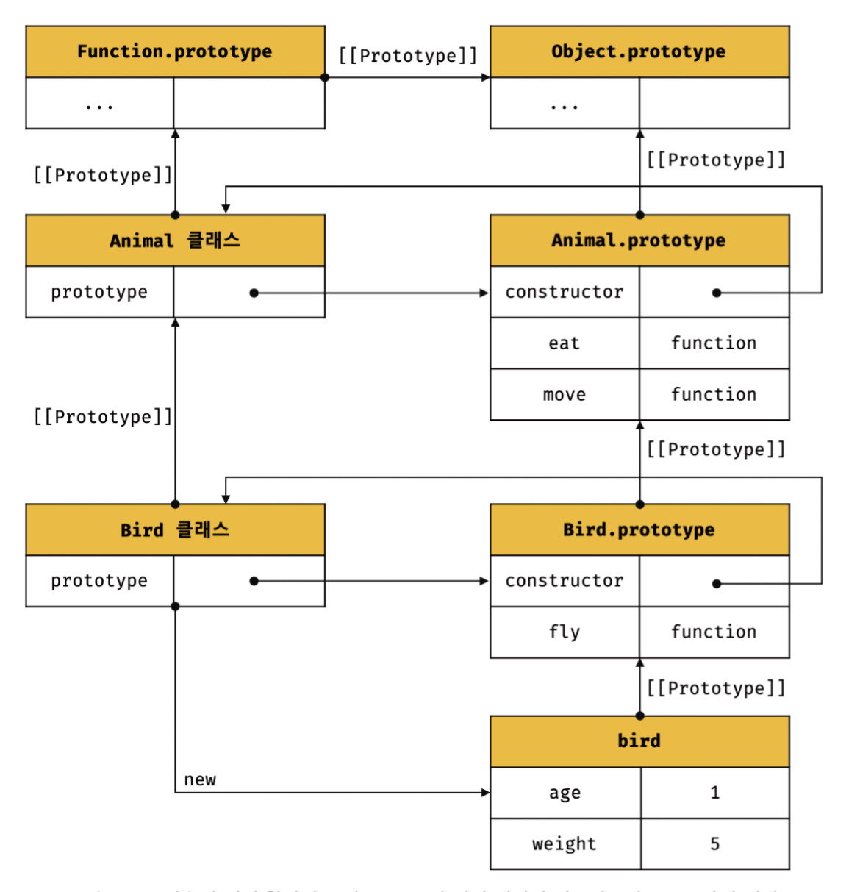
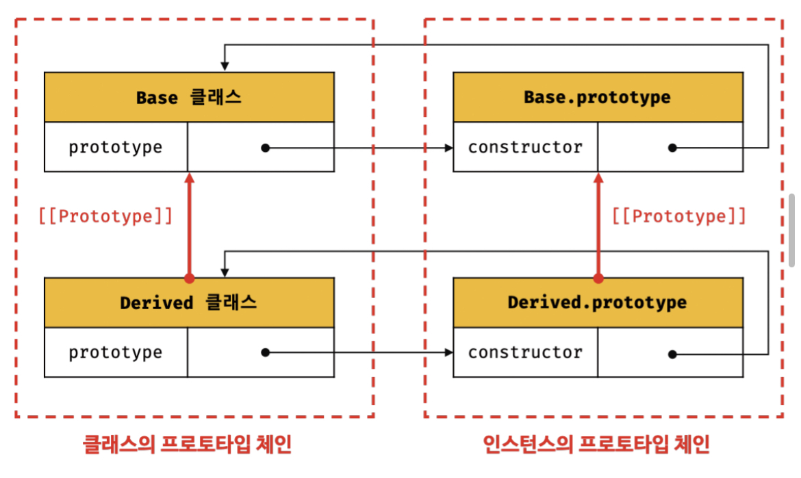

# 25.8 상속에 의한 클래스 확장
## 25.8.1 클래스 상속과 생성자 함수 상속
- 프로토타입 기반 상속은 프로토타입 체인을 통해 다른 객체의 자산을 상속받는 개념
- `상속에 의한 클래스 확장은 기존 클래스를 상속받아 새로운 클래스를 확장(extends)하여 정의`

- 클래스는 상속을 통해 기존 클래스를 확장할 수 있는 문법이 기본적으로 제공되지만 생성자 함수는 그렇지 않다.

- 동물을 추상화한 Animal 클래스와 새와 사자를 추상화한 Bird, Lion 클래스를 각각 정의
- 새와 사자는 동물에 속하므로 동물의 속성을 갖지만 자신만의 고유한 속성도 갖는다.

예저 25-24
```javascript
class Animal {
  constructor(age, weight) {
    this.age = age;
    this.weight = weight;
  }

  eat() { return 'eat'; }

  move() { return 'move'; }
}

// 상속을 통해 Animal 클래스를 확장한 Bird 클래스
class Bird extends Animal {
  fly() { return 'fly'; }
}

const bird = new Bird(1, 5);

console.log(bird); // Bird {age: 1, weight: 5}
console.log(bird instanceof Bird); // true
console.log(bird instanceof Animal); // true

console.log(bird.eat());  // eat
console.log(bird.move()); // move
console.log(bird.fly());  // fly
```
- Bird 클래스는 상속을 통해 Animal 클래스의 속성을 그대로 사용하고 자신만의 고유한 속성을 추가하여 확장했다.

- 상속에 의해 확장된 클래스 Bird를 통해 생성된 인스턴스의 프로토타입 체인
- 클래스는 상속을 통해 다른 클래스를 확장할 수 있는 문법인 extends 키워드가 기본적으로 제공된다.
- extends 키워드를 사용한 클래스 확장은 간편하고 직관적이다.

예제 25-55
```javascript
// 의사 클래스 상속(pseudo classical inheritance) 패턴
var Animal = (function () {
  function Animal(age, weight) {
    this.age = age;
    this.weight = weight;
  }

  Animal.prototype.eat = function () {
    return 'eat';
  };

  Animal.prototype.move = function () {
    return 'move';
  };

  return Animal;
}());

// Animal 생성자 함수를 상속하여 확장한 Bird 생성자 함수
var Bird = (function () {
  function Bird() {
    // Animal 생성자 함수에게 this와 인수를 전달하면서 호출
    Animal.apply(this, arguments);
  }

  // Bird.prototype을 Animal.prototype을 프로토타입으로 갖는 객체로 교체
  Bird.prototype = Object.create(Animal.prototype);
  // Bird.prototype.constructor을 Animal에서 Bird로 교체
  Bird.prototype.constructor = Bird;

  Bird.prototype.fly = function () {
    return 'fly';
  };

  return Bird;
}());

var bird = new Bird(1, 5);

console.log(bird); // Bird {age: 1, weight: 5}
console.log(bird.eat());  // eat
console.log(bird.move()); // move
console.log(bird.fly());  // fly
```
- 자바스크립트는 클래스 기반 언어가 아니므로 생성자 함수를 사용하여 클래스를 흉내내려는 시도를 권장하지 않지만 `의사 클래스 상속 pseudo classical inheritance` 패턴을 사용하여 상속에 의한 클래스 확장을 흉내 내기도 했다.
- 클래스의 등장으로 의사 클랙스 상속 패턴은 더는 필요하지 않다. 참고 용도

## 25.8.2 extends 키워드
예제 25-56
```javascript
// 수퍼(베이스/부모)클래스
class Base {}

// 서브(파생/자식)클래스
class Derived extends Base {}
```
- 슈퍼클래스(super), 베이스클래스(base), 부모클래스(parent)
- 서브클래스(sub), 파생클래스(derived), 자식클래스(child)

- 슈퍼클래스와 서브클래스는 인스턴스의 프로토타입 체인뿐 아니라 클래스 간의 프로토타입 체인도 생성한다.
- 이를 통해 프로토타입 메서드, 정적 메서드 모두 상속이 가능하다.

## 25.8.3 동적 상속

예제 25-57
```javascript
// 생성자 함수
function Base(a) {
  this.a = a;
}

// 생성자 함수를 상속받는 서브클래스
class Derived extends Base {}

const derived = new Derived(1);
console.log(derived); // Derived {a: 1}
```
- extends 키워드는 클래스뿐만 아니라 `생성자 함수를 상속받아 클래스를 확장`할 수 있다.

예제 25-58
```javascript
function Base1() {}

class Base2 {}

let condition = true;

// 조건에 따라 동적으로 상속 대상을 결정하는 서브클래스
class Derived extends (condition ? Base1 : Base2) {}

const derived = new Derived();
console.log(derived); // Derived {}

console.log(derived instanceof Base1); // true
console.log(derived instanceof Base2); // false
```
- extends 키워드 뒤에 `함수 객체로 평가될 수 있는 모든 표현식`을 사용할 수 있다.
- 이를 통해 동적으로 상속받을 대상을 결정할 수 있다.

## 25.8.4 서브클래스의 constructor
클래스에서 constructor를 생략하면 클래스에 비어 있는 constructor가 암묵적으로 정의된다.

예제 25-60
```javascript
constructor(...args) { super(...args); }
```
- 서브클래스에서 constructor를 생략하면 다음과 같은 constructor가 암묵적으로 정의된다.
- args는 new 연산자와 함께 클래스를 호출할 때 전달한 인수의 리스트다

`Rest 파라미터`
- 매개변수에 ...을 붙이면 Rest 파라미터가 된다. Rest 파라미터는 함수에 전달된 인수들의 목록을 `배열`로 전달 받는다.

예제 25-61
```javascript
// 수퍼클래스
class Base {}

// 서브클래스
class Derived extends Base {}
```
- 수퍼클래스와 서브클래스 모두 constructor를 생략했다.
예제 25-62
```javascript
// 수퍼클래스
class Base {
  constructor() {}
}

// 서브클래스
class Derived extends Base {
  constructor() { super(); }
}

const derived = new Derived();
console.log(derived); // Derived {}
```
- constructor를 생략하면 위와 같이 암묵적으로 constructor가 정의된다.
- 수퍼클래스와 서비클래스 모두 constructor를 생략하면 빈 객체가 생성된다.